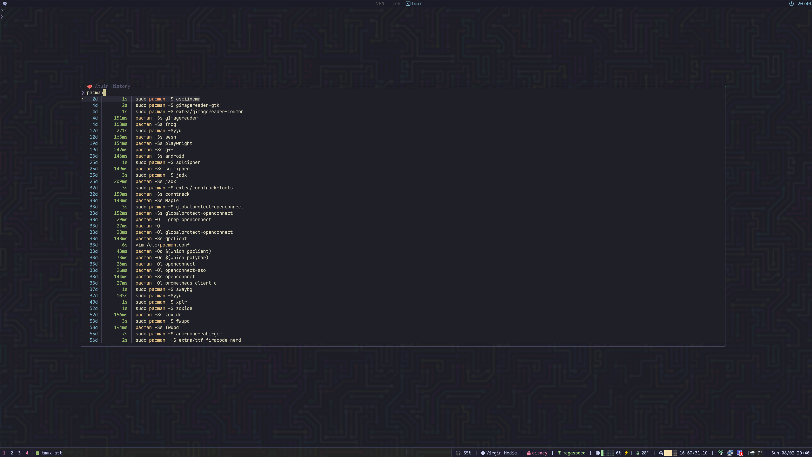

# 🐙 tmux-atuin

A beautiful, fast shell history search plugin that combines the power of [Atuin](https://github.com/atuinsh/atuin) with [fzf](https://github.com/junegunn/fzf) in a styled tmux popup.

> **Note:** This project was 100% vibe coded using [OpenCode](https://opencode.ai) and Claude 🤖✨



## ✨ Features

- **🚀 Blazing Fast** - Queries Atuin's SQLite database directly, bypassing the CLI for instant results
- **🎨 Beautiful Kanagawa Theme** - Gorgeous colors inspired by the [Kanagawa](https://github.com/rebelot/kanagawa.nvim) colorscheme
- **✅ Success Only** - Only shows commands that exited successfully (exit code 0)
- **🔄 Deduplicated** - No duplicate commands cluttering your history
- **📊 Rich Information** - Shows relative time and duration for each command
- **🪟 tmux Integration** - Opens in a beautiful floating tmux popup
- **⚡ Async Loading** - Can be loaded asynchronously with `zsh-defer` for instant shell startup

## 📋 Requirements

- [tmux](https://github.com/tmux/tmux) (for popup support)
- [Atuin](https://github.com/atuinsh/atuin) (shell history sync)
- [fzf](https://github.com/junegunn/fzf) (fuzzy finder)
- [sqlite3](https://sqlite.org/) (for direct database queries)
- [zsh](https://www.zsh.org/) (shell)

## 📦 Installation

### Manual

```bash
git clone https://github.com/bechampion/tmux-atuin.git ~/.zsh-plugins/tmux-atuin
```

Add to your `~/.zshrc`:

```zsh
source ~/.zsh-plugins/tmux-atuin/tmux-atuin.plugin.zsh
```

### With zsh-defer (Recommended)

For instant shell startup, load the plugin asynchronously:

```bash
# First, install zsh-defer if you don't have it
git clone https://github.com/romkatv/zsh-defer.git ~/.zsh-plugins/zsh-defer
```

Then in your `~/.zshrc`:

```zsh
# Load zsh-defer first (must be synchronous)
source ~/.zsh-plugins/zsh-defer/zsh-defer.plugin.zsh

# Defer heavy plugins
zsh-defer source ~/.zsh-plugins/tmux-atuin/tmux-atuin.plugin.zsh
```

### With zinit

```zsh
zinit light bechampion/tmux-atuin
```

### With zplug

```zsh
zplug "bechampion/tmux-atuin"
```

## ⌨️ Key Bindings

| Key | Action |
|-----|--------|
| `Ctrl+r` | Open history search popup |
| `Ctrl+d` | Page down (half page) |
| `Ctrl+u` | Page up (half page) |
| `Enter` | Select command and paste to prompt |
| `Esc` | Close popup |
| `Ctrl+c` | Close popup |

## 🎨 Color Scheme

The plugin uses the beautiful [Kanagawa](https://github.com/rebelot/kanagawa.nvim) color palette:

| Element | Color | Hex |
|---------|-------|-----|
| Background | sumiInk1 | `#1F1F28` |
| Foreground | fujiWhite | `#DCD7BA` |
| Time | springBlue | `#7FB4CA` |
| Duration | springGreen | `#98BB6C` |
| Separator | sumiInk4 | `#54546D` |
| Highlight | carpYellow | `#E6C384` |
| Selection highlight | surimiOrange | `#FFA066` |
| Prompt | oniViolet | `#957FB8` |
| Border | sumiInk4 | `#54546D` |

## 🔧 How It Works

Unlike traditional shell history search, tmux-atuin:

1. **Queries SQLite directly** - Instead of spawning Atuin's CLI, we query the SQLite database directly for maximum speed
2. **Filters at the source** - Only successful commands (exit code 0) are retrieved
3. **Deduplicates intelligently** - Groups by command and shows the most recent occurrence
4. **Formats beautifully** - Adds colors via ANSI escape codes before passing to fzf
5. **Extracts cleanly** - Strips metadata when pasting to ensure only the command is inserted

### The SQL Query

```sql
SELECT 
    -- Relative time (e.g., "3m", "2h", "5d")
    CASE 
        WHEN age < 60 THEN age || 's'
        WHEN age < 3600 THEN (age / 60) || 'm'
        WHEN age < 86400 THEN (age / 3600) || 'h'
        ELSE (age / 86400) || 'd'
    END,
    -- Duration (e.g., "80ms", "2s")
    CASE 
        WHEN duration < 1000000000 THEN (duration/1000000) || 'ms'
        ELSE (duration/1000000000) || 's'
    END,
    -- Command (newlines replaced with spaces)
    replace(replace(command, char(10), ' '), char(13), ' ')
FROM history 
WHERE exit = 0 AND deleted_at IS NULL 
GROUP BY command
ORDER BY MAX(timestamp) DESC 
LIMIT 3000
```

## 🤝 Related Projects

- [tmux-ghostcomplete](https://github.com/bechampion/tmux-ghostcomplete) - Screen-aware autocomplete in tmux popup
- [Atuin](https://github.com/atuinsh/atuin) - Magical shell history
- [fzf](https://github.com/junegunn/fzf) - Command-line fuzzy finder
- [Kanagawa.nvim](https://github.com/rebelot/kanagawa.nvim) - Dark colorscheme inspired by Katsushika Hokusai

## 📄 License

MIT License - See [LICENSE](./LICENSE) for details.

## 🙏 Credits

- [Atuin](https://github.com/atuinsh/atuin) for the amazing shell history sync
- [fzf](https://github.com/junegunn/fzf) for the fuzzy finder
- [Kanagawa](https://github.com/rebelot/kanagawa.nvim) for the beautiful color palette
- [zsh-defer](https://github.com/romkatv/zsh-defer) for async loading
- [OpenCode](https://opencode.ai) + Claude for the vibe coding session that created this ✨

---

<p align="center">
  Made with 🐙 by <a href="https://github.com/bechampion">bechampion</a>
  <br>
  <sub>100% vibe coded with <a href="https://opencode.ai">OpenCode</a> + Claude 🤖</sub>
</p>
